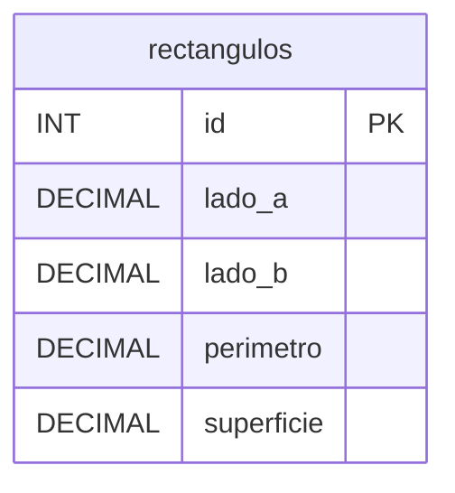

# Diagrama entidad-relación — Ejercicio 1

El modelo consta de una única entidad, por lo que no existen relaciones entre
tablas.

`perimetro` y `superficie` se almacenan por requerimiento del enunciado y son
calculados por el servidor a partir de los lados en cada operación de escritura.
Nunca se aceptan como datos de entrada.

Los lados y el perímetro se definen como `DECIMAL(10, 2)` y la superficie como
`DECIMAL(12, 4)`, para conservar los cuatro decimales que resultan de
multiplicar dos valores de dos decimales. Se elige `DECIMAL` en lugar de `FLOAT`
porque almacena los valores de forma exacta, sin el error de redondeo propio del
punto flotante binario.
