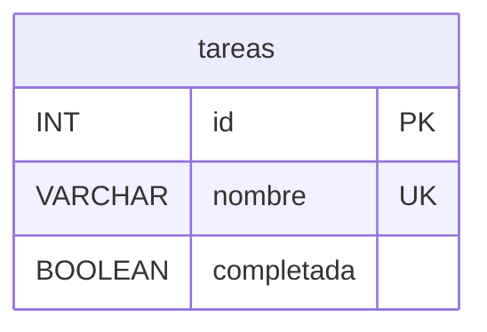

# Diagrama entidad-relación — Ejercicio 2

El modelo consta de una única entidad, por lo que no existen relaciones entre
tablas.

`nombre` es `VARCHAR(255)`, obligatorio y con restricción de unicidad
(`UNIQUE KEY uk_tareas_nombre`). Su colación es `utf8mb4_es_0900_ai_ci`, que
define cuándo dos nombres se consideran iguales: no distingue mayúsculas de
minúsculas ni vocales con tilde de vocales sin tilde, y trata a la `ñ` como una
letra distinta de la `n`.

`completada` es `BOOLEAN`, obligatorio, con valor por defecto `FALSE`. En MySQL
`BOOLEAN` es un alias de `TINYINT(1)`: se almacena como `1` o `0` y la API lo
traduce a `true` o `false` al responder.
