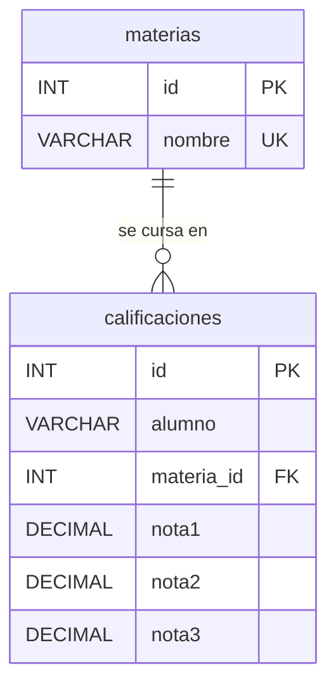

# Diagrama entidad-relación — Ejercicio 3

## Relación

Una materia puede tener muchos registros de calificaciones, y cada registro
pertenece a exactamente una materia (relación uno a muchos). La relación se
implementa con la clave foránea `calificaciones.materia_id`, que referencia a
`materias.id`:

- `ON DELETE RESTRICT`: no se puede eliminar una materia que tiene
  calificaciones registradas.
- `ON UPDATE CASCADE`: si cambiara el id de una materia, sus registros lo
  acompañan.

## Restricciones

- `materias.nombre` es único (`uk_materias_nombre`).
- La combinación `(alumno, materia_id)` es única
  (`uk_calificaciones_alumno_materia`): un alumno no puede tener más de un
  registro en la misma materia. Es una clave única compuesta, por lo que el
  diagrama no la muestra como atributo individual.
- `nota1`, `nota2` y `nota3` son `DECIMAL(4, 2)` y cada una tiene una
  restricción `CHECK` que la limita a la escala de 0 a 10.
- Todas las columnas son obligatorias (`NOT NULL`).

`materias.nombre` y `calificaciones.alumno` usan la colación
`utf8mb4_es_0900_ai_ci`: al comparar no se distinguen mayúsculas de minúsculas
ni vocales con tilde de vocales sin tilde, y la `ñ` es una letra distinta de la
`n`.
